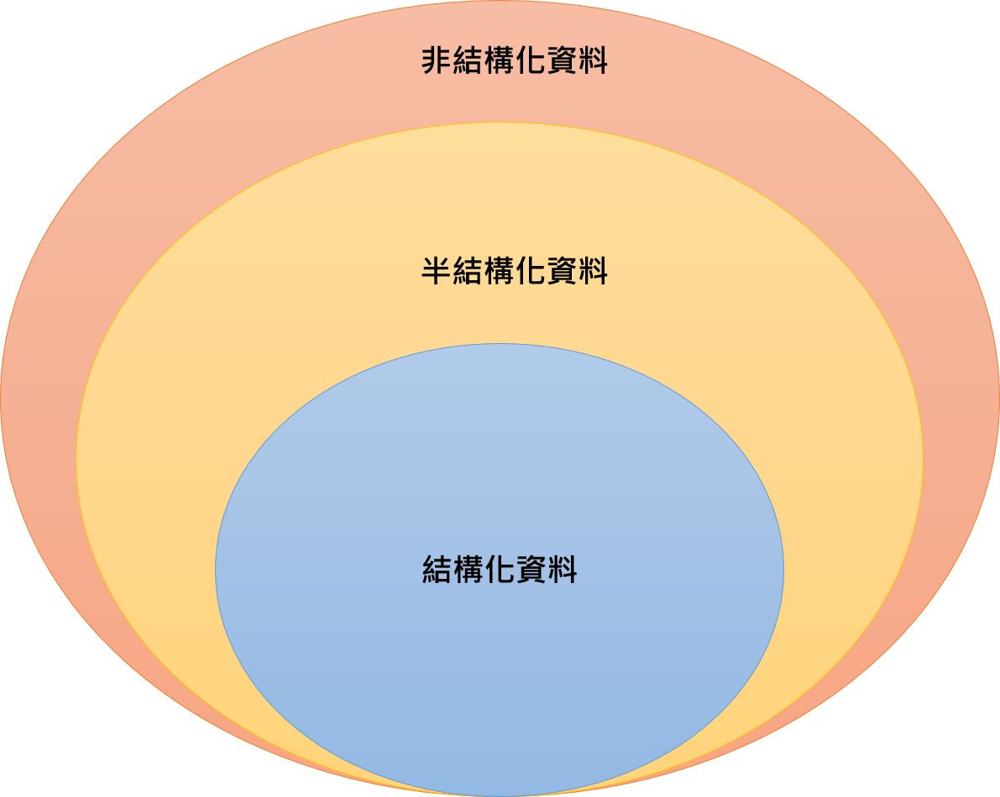

# Day 5 - 課程內容 - 如何新建一個 dataframe? 如何讀取其他資料? (非 csv 的資料)

## 5-1 如何新建一個 dataframe?

### 知識地圖

新建一個DataFrame，在數據前處理中扮演著非常重要的角色，DataFrame除了可以讓我們更好地了解手邊的數據集，也能將數據做到許多的清理，像是要填補缺失值、找到哪筆數據比較大或比較小、歸納數據等等

### 為什麼新建一個 DataFrame 重要?

**需要把分析過程中所產生的數據或者結果儲存為結構化的資料**

- 例子1：將每筆交易資料匯總計算平均值、標準差等統計數值
- 例子2：Kaggle 比賽要上傳的結果
- 更好的閱讀

將資料轉成結構化的DataFrame資料可以快速地使用Pandas提供的方法，來對資料進行很多的統計分析與數據清洗

**補充: 結構化資料的定義**

結構化資料的定義參考: https://daxpowerbi.com/%E7%B5%90%E6%A7%8B%E5%8C%96%E8%B3%87%E6%96%99/

結構化資料: 先有結構，才會有資料，也就是我們先定義好了有哪些的欄位，然後再去填資料，像是我們要製作一個學生成績調查，那我會先定義好一個表格架構，有學生號碼、學生姓名、年齡、成績等等

**測試程式碼**

- 有時候原始資料太大了，有些資料的操作很費時，先在具有同樣結構的資料上測試程式碼是否能夠得到理想中的結果。
- 不確定視覺化程式碼中所需要的資料結構，用新建立的 dataframe 結構來去了解，而不是急著在原始資料上操作。

有時候數據集的數量真的太大了，我們做任何的操作都需要花上很久的時間，這時候我自己很常就會創造一個仿造數據集的DataFrame或是取數據集的一小部份資料來進行處理，就能模擬出如果放到大數據集時，會產生的結果

### 重要知識點複習

- 在資料量很大時，可以先在和資料具有同樣結構的小樣本驗證程式碼執行的結果是否符合預期
- 用 pd.DataFrame 來創建一個 dataframe
- 用 np.random.randint 來產生隨機數值

## 5-2 如何讀取其他資料？ (非CSV的資料)

### 讀取其他非csv資料格式？

**圖片**

這邊我會在範例中，透過實作帶大家了解，如何透過不同的套件來讀取圖片

**npy檔**

在我自己的工作經驗上，我們很常將數據集轉成NumPy數組，並保存成npy檔，當下次要使用這份數據集時，讀入就會非常的快

**Pickle檔**

非常常大的一個格式檔，我用過它來存放過機器學習的model跟很多種不同的資料

### 重要知識點複習

- 文字格式：通常可以用 with open() 
- 圖像格式：可以使用 PIL, Skimage 或是 CV2 (CV2 的速度較快，但須注意讀入的格式為 BGR)
- 其他形式如 npy / pickle 可以儲存經過處理後的資料

文字格式像是txt檔、json檔、yaml檔等等都很常使用with open來打開喔

圖像格式； 我會在範例中帶大家使用這些套件，也會來測試一下它們讀取圖片的速度喔

其他形式: npy 專們用來存放NumPy數組和pickle用來存放很多不同的檔案

